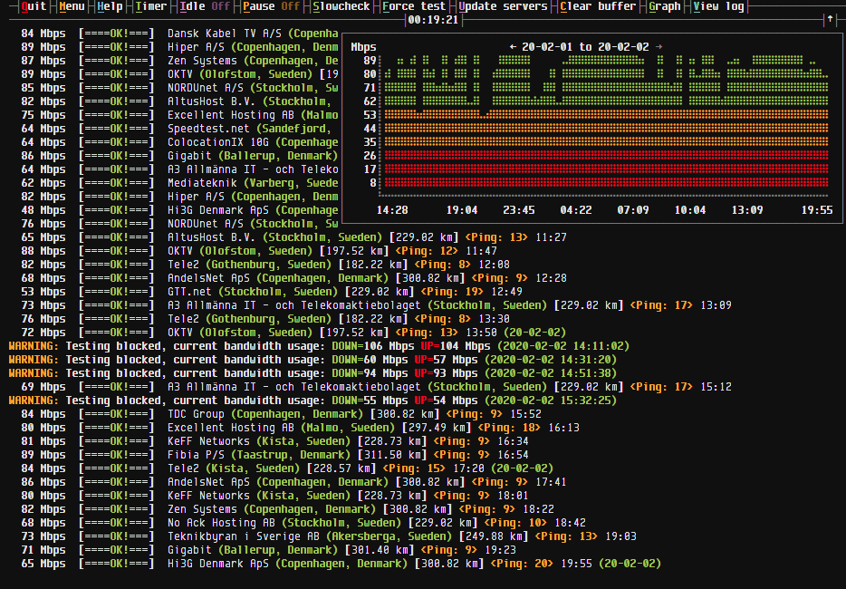

# spdtest.sh

**State:** Beta  
**Version:** 0.3.0  
**Usage:** Script with UI for testing internet speed reability  
**Language:** Bash & Python  

## Description

Internet speeds are tested against random servers from speedtest.net at an timed interval (defined by user).  
If slow speed (defined by user) is detected, then runs a number of download and upload test with optional route tests to servers and writes to a logfile.

## Screenshots

Main UI with graph on.

## Features

* Function for checking current bandwidth usage to block false positives. Can optionally collect bandwidth usage from a router running linux with a ssh server enabled.
* Scrollable graph showing speeds over time.
* All output in the UI is also scrollabe with UP, DOWN, PAGE_UP, PAGE_DOWN, HOME, END keys working as you would expect.
* Option to have the timer reset on any mouse or keyboard activity in XServer.
* Option to have the timer auto pause when monitor is on and unpause when monitor is off.
* Unit used can be switched between Mbits and MB/s.
* Function for splitting log files at a defined size, old log files can also be automatically compressed.

## Dependencies

**bash** (v4.4 or later) Script functionality might brake with earlier versions.  

**[Python 3](https://www.python.org/downloads)** (v3.7 or later) Needed for speedtest-cli, grc and getIdle.  

**[speedtest](https://www.speedtest.net/apps/cli)** Official speedtest client from Ookla, needs to be in path or defined in config.

**[jq](https://stedolan.github.io/jq/)** Needed for json parsing.  

## Included

**[speedtest-cli](https://github.com/sivel/speedtest-cli)** Used to get serverlist, since official speedtest client from Ookla is limited to 10 servers.  
Modified and heavily stripped down, based on version 2.1.2. Python code included in the script.

**[grc](https://github.com/garabik/grc)** For making text output in the UI pretty.  
Modified version of grcat. Python code included in the script.

**getIdle** Get XServer idle time. Python code included in script.

## Optionals

**[mtr](https://github.com/traviscross/mtr)** Needed if you want to check routes to slow servers.  

**[less](http://www.greenwoodsoftware.com/less/)** Needed if you want option to view logfile from UI.  

## TODO

- [ ] TODO Fix argument parsing and error messages
- [ ] TODO Change slowtest to multiple servers and compare results
- [ ] TODO fix wrong keypress in inputwait, esc codes etc
- [ ] TODO fix up README.md
- [ ] TODO extern config and save to config?
- [x] TODO ssh controlmaster, server, client for precheck_speed
- [ ] TODO buffer logview
- [ ] TODO route test menu, choose host to test
- [ ] TODO windows: help, options, route
- [x] TODO plot speedgraphs overtime in UI  
- [ ] TODO stat file
- [ ] Everything else...

## LICENSE
[Apache License 2.0](LICENSE)